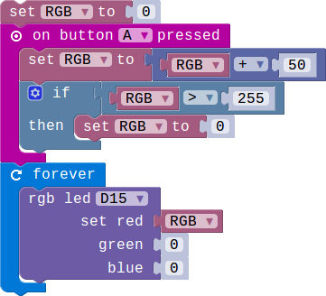

## Lesson 1.2 手动调节灯的亮度--Rotary的使用

- Duration: 10 minutes
- Difficulty: Beginner

### Introduction

这一节的内容主要是介绍电位器（Rotary）的使用。RGB灯的亮度可以通过调节RGB三个灰度值的大小来设置，而这三个值可以和我们的Rotary模块结合起来进行调节。

### Materials

| Item |     Component          | Quantity |
|------  |-------------------          |----------    |
|    1   | Micro:bit                   |        1      |
|    2   | Connect Board          |        1     |
|    3   | RGB LED module      |        1     |
|    3   | Rotary LED module  |        1      |
|    4   | USB Micro-B Cable   |        2     |
|    5   | E-brick Cable            |        1     |

### Electronic Circuit

First we need to build the electroic circuit. 

| Sensor Module ID | Connect Board Connector ID | Micro:bit Pin ID | Signal Type |
|------------------|----------------------------|------------------|-------------|
| RGB-LED#1        | D15                         | pin15/pin16             | Digital IO  |
| Rotary#1        | A0                         | pin0             | Analog IO  |

### Create Code

#### Step 1: 通过按键调节RGB灯的亮度!

  
 
通过按键A控制RGB灯的亮度，一共有5档，循环控制灯的亮度。

#### Step 2: RGB亮度自动变化！

 
 
通过这样的操作RGB灯每隔一秒钟会切换一种亮度，从最亮到最暗一共四个档位，依次循环。

#### Step 3: 获取电位器旋转的百分比!

 

这样我们就可以获取当前电位器旋转的百分比并显示出来。这个方法会返回0到100的值，所以我们在使用的时候需要注意，如果我们需要用到百分比数据，需要将返回的值除以100。

#### Step 4: 通过旋转电位器来调节灯的亮度！ 

  
 
 通过旋转电位器可以看到RGB灯的亮度再随之改变。

### Interaction

> TODO:Add a gif/video/pic

### What next

> 实现按键A控制RGB灯的亮度变高，按键B控制灯的亮度变低。

### Reference

- [Potentiometer](https://en.wikipedia.org/wiki/Potentiometer)
