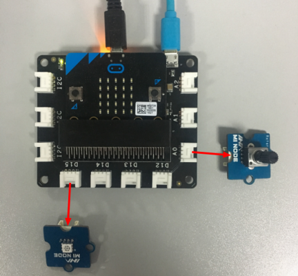

# Lesson 03-02 Make the brightness tunable manually

- Duration: 10 minutes
- Difficulty: Beginner

### Introduction

This lesson we'll teach you have to use the Rotary module. We'll use the Rotary module to adjust the brightness.

### Materials

| Item | Component         | Quantity |
| ---- | ----------------- | -------- |
| 1    | Micro:bit         | 1        |
| 2    | Connect Board     | 1        |
| 3    | RGB LED module    | 1        |
| 3    | Rotary LED module | 1        |
| 4    | USB Micro-B Cable | 2        |
| 5    | E-brick Cable     | 1        |

### Electronic Circuit

First we need to build the electroic circuit. 

| Sensor Module ID | Connect Board Connector ID | Micro:bit Pin ID | Signal Type |
| ---------------- | -------------------------- | ---------------- | ----------- |
| RGB-LED#1        | D15                        | pin15/pin16      | Digital IO  |
| Rotary#1         | A0                         | pin0             | Analog IO   |

### Create Code

#### Step 1: Let's adjust the brightness by pressing button A

  

There're total 5 gears to adjust the brightness.

#### Step 2: Brightness changed cyclically

 

#### Step 3: Acquire the percentage of the knob

 

It'll return a number between 0 to 100.

#### Step 4: Let's adjust brightness by turning the knob of the Rotary module 

  

### Interaction

>  **TODO**
>
> [Software Team] Add a vedio

### What next

1. Implement the below functions:
   1. Let the button A turn up the brightness
   2. Let the button B turn down the brightness

### Reference

- [Potentiometer](https://en.wikipedia.org/wiki/Potentiometer)
