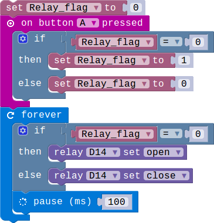
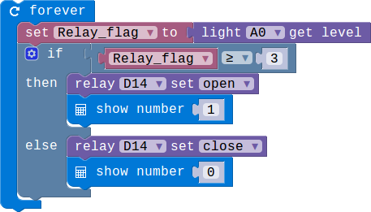

# Lesson 04-01 Meet the Relay module

- Duration: 10 minutes
- Difficulty: Beginner

### Introduction

A relay is an electrically operated switch. You can use it to control many things like the bulbs.

### Materials

| Item | Component           | Quantity |
| ---- | ------------------- | -------- |
| 1    | Micro:bit           | 1        |
| 2    | Connect Board       | 1        |
| 3    | Relay module        | 1        |
| 3    | Light sensor module | 1        |
| 4    | USB Micro-B Cable   | 2        |
| 5    | E-brick Cable       | 1        |

### Electronic Circuit

First we need to build the electroic circuit.

> **TODO**
>
> [Software Team] Insert the electronic picture

| Sensor Module ID | Connect Board Connector ID | Micro:bit Pin ID | Signal Type |
| ---------------- | -------------------------- | ---------------- | ----------- |
| Relay#1          | D14                        | pin14            | Digital IO  |
| Light Sensor#1   | A0                         | pin0             | Analog IO   |

### Create Code

#### Step 1: Turn ON/OFF by pressing a button

 

#### Step 2:  Optical control the Relay

 

### Interaction

> **TODO**
>
> [Software Team] Add a vedio

### What next

1. Implement a program: Turn on the Relay when the ambient light level is 5 and turn off the Relay when the ambient light level below 3.

### Reference

- [Relay](https://en.wikipedia.org/wiki/Relay)
